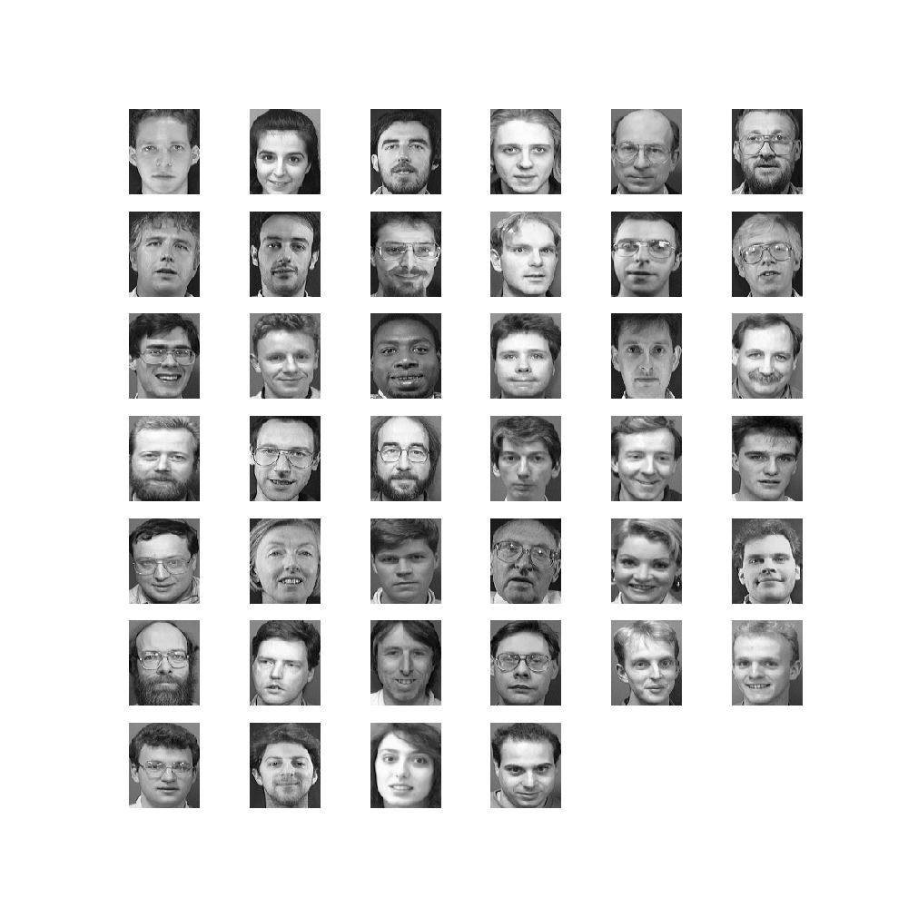
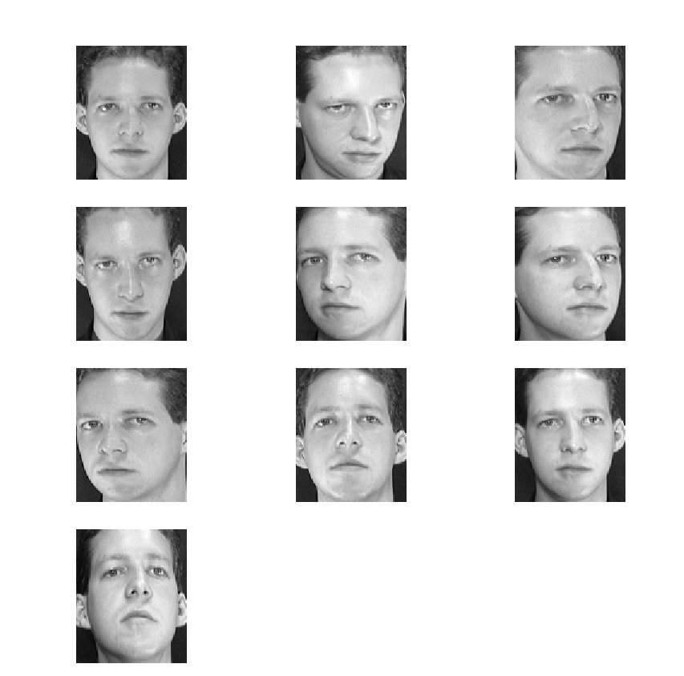
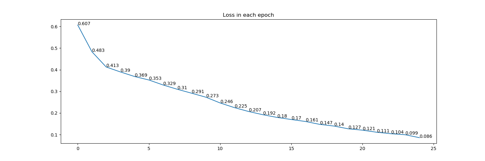
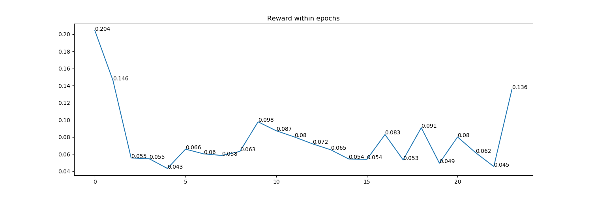
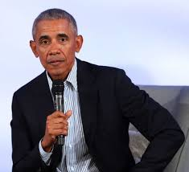
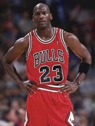

# Face Recognition for Recognizing Neighbor and Stranger

### Author: Yiling Liu (Individual Project)
### Student ID: 22214014

# Usage

## Requirements:

- dlib
- cv2
- tensorflow 2.0+
- matplotlib

## How to run

### To train the model

1. enter `build_model`
2. run `__main__.py`
I haven't change the import path for `python -m build_model`(It would be easier for myself to debug in VSCode), if you want to do that, please change the import path from `xxx`(modules in this dir) to `build_model.xxx`

Trained result will be available in `build_model/models`, If you want to see the losses within epochs, the training loss will be available in `build_model/report_figs`

### To apply the model for face recognition

1. enter `detect_face`
2. run `__main__.py`
The paths in this module haven't change for `python -m detect_face`, too. Change the import path to `detect_face.xxx` if you want to use it.

The result will be printed in the terminal.

If you want to use your own images, please put valid images in `detect_face/valid_faces`, and the faces for testing in `detect_face/test`.Remember to use images with less emotions otherwise the model cannot work.

# Background Description

## Why Choose this Project

I am living in an apartment which has 7 floors. The neighbor who living in 7th floor is a kind, talkative man  - we call him uncle Fu. He always knock my door and come to chat with my father. But the security of our apartment is quite lax, every days there are some salesman knock our door to sell their products. It is quite annoying, and it is not polite to open the door and drive them away directly. There are two ways to solve this problem: to spend about 2,000 CNY to buy a new door with sight window, or to recognize who is knocking the door without opening the interior door (with ai tech and Raspberry Pi. Taking photo while the body sensor module detect there is a person at the door, and analyze if that photo contains uncle Fu or not) so we can pretend there is nobody at home and the salesman will leave.

This project will not spend too much time in training model, too. Unlike the large datasets on Kaggle like recognizing the right whales, it is impossible for me to take hundreds of photo of uncle Fu so the training data will not be sufficient.

## Techs will be used in this Project(Initial plan)

- CNN - Feature detection
- Siamese Network
- OpenCV - Locate human face from a photo


## Techs used in this Project(Final version)

- CNN
- Siamese Network
- nary-tree - Manage file system to find pictures in the appointed directory
- OpenCV - Crop and resize image
- dlib - cv2.CascadeClassifier is not precise enough, dlib is better

## Existed Face Recognition Libraries
- [deepface](https://github.com/serengil/deepface)
- [face recognition](https://github.com/ageitgey/face_recognition)
-  ......

Although those libraries on Github is robust and mature, I still need to train my own neural network to study how to do it without an all-in library.

It is quite time consuming for me to train a model to label and crop the human face region from the whole picture, so I use dlib directly to do this work.

# Project Scope and Limitations

## Project Scope

This project just do the coding part (generate a model and recognize face in the imported photo).

Other steps, including use Raspberry Pie to take photo and transmit it to cloud server for computer inside room to download are related to IoT and Cloud Computing but not AI. So they could be ignored temporarily in this AI unit project.


## What to be Improved

To make it easier for project presentation and the marking of teacher, I did a lots of I/O and save some middleware(images, csv files) inside the disk.

The improvements we can make in this project are:

**Code Optimization**

1. For `build_model`, do not save cropped images directly in a disk, save their numpy array as a `.npy` file instead of cropped image + file path in a `.csv` file
   
2. For `detect_face`, valid face could be saved in a `.npy` file and load while using it, instead of read all images and convert it into numpy array each time while running the program.

3. The data format in this dataset is HWC, but CHW is much efficient to train on GPU. 
   
**Model Performance**

Noises could be add in the training pictures (blur, add some rare color block, .etc) to recognize photos in complicated environments.

# Training process (directory `build_model`)

## Overview
The training data I use is [AT&T Database of Faces](https://www.kaggle.com/kasikrit/att-database-of-faces) from Kaggle which contains 40 people's face, these 40 people could be previewed in the following figure

<center></center>

*<center>Fig1. AT&T Dataset Preview</center>*

For single person, his/her emotions will like this:


<center></center>


To meet the face cropped by dlib, I cropped the faces in this dataset - remove hair from the photo

<center></center>

*<center>Fig2. Original Image</center>*

<center> </center>

*<center>Fig3. Cropped Image</center>*

I sampled 30,000 pairs of data from training images to build the dataset (80% training set, 20% test set) to train the for 25 epochs.

## Loss Analyze
The loss of each epoch are shown in the following figure

<center></center>

*<center>loss in each epoch</center>*


The 'Reward' between two adjacent epochs could be defined as

$$
\frac{x_{i - 1} - x_i}{x_{i - 1}}
$$

It is also known as `f'(x)`  of loss in each epoch

<center></center>

The highest reward happen between epoch one and two and get fluctuated in the following epochs. It is clear that the losses are decreasing continuously through the whole training process.

## Model Structure

1. Input Layer(92 * 92)
2. Max Pooling Layer (3 x 3)
3. Drop out (0.25)
4. Convolution Layer (Kernel size = 3 x 3, Stride = 1, padding = valid)
5. Drop out (0.25)
6. Convolution Layer (Kernel size = 2 x 2, Stride = 1, padding = valid)
7. Max Pooling Layer (3 x 3)
8. Drop out (0.25)
9. Flatten
10. Dense(1024)
11. Drop out(0.1)
12. Dense(512, relu)
13. Dense(128, relu)
14. Dense(64,relu)
15. Lambda Layer: Count the distance between two 1 * 64 vectors. The distance is defined as $|x_1 -x_2|$ for $x_1$ from a vector trained from image 1 with step 1-14 and $x_2$ from vector from image 2 trained by step 1-14 
16. Output layer: return a number between 0 - 1(Sigmoid activation transformed the original number to 0-1 interval)

In my understanding, relu uses to reduce the dimension of variables(change negative variable to 0 to deactivate it) to extract important features.

## Result

For valid photo Obama1


and Obama2



We use another Obama photo


and Jordan



To match them

The result is:
```
obama.pgm matches obama2.pgm, match rate: 0.899
No valid person found! for jordan.pgm
```

The reason why Obama photo cannot match Obama 1 is that we do not have that kind of smiley face in our training images, but Obama2 and Obama both have less emotion, so they match successfully.

## Time spent

2 days in design and coding. I was working on the project for project management at that time, too. So I just finish this face recognition model and leave it there and come to work for PM project. One week later the lock got fixed.